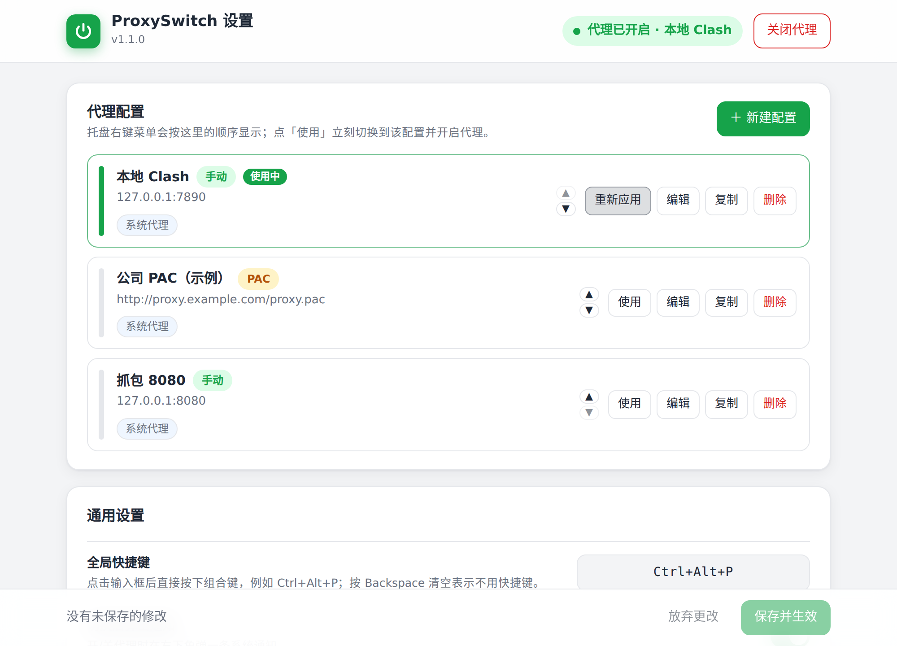

# ProxySwitch

一个常驻系统托盘的 Windows 小工具，用来一键开关、切换代理：

- **左键**托盘图标：开 / 关当前代理（图标绿色 = 已开启，灰色 = 已关闭）
- **右键**托盘图标：在多套代理配置之间切换、打开设置页面、开机自启、退出
- **图形化设置页面**：新建 / 编辑 / 排序配置、按键录入快捷键、勾选生效范围、测试代理能否连通，不用碰配置文件
- **全局快捷键**（默认 `Ctrl+Alt+P`）：不用找托盘也能一键开关
- 支持 **Windows 系统代理**（含 PAC 自动配置脚本），可选同时设置 **用户环境变量**（`HTTP_PROXY` / `HTTPS_PROXY` / `NO_PROXY`）、**git** 全局代理、**npm / pnpm** 代理
- 别的程序（比如 Clash）改了系统代理，托盘图标也会在几秒内自动跟上
- 单文件 exe，纯 Go 编写，不依赖任何第三方库，不需要管理员权限

## 安装与使用

1. 从 [Releases](https://github.com/whrss9527/proxyswitch/releases) 下载 `ProxySwitch.exe`，放到任意目录双击运行，任务栏右下角会出现托盘图标。
   - 首次运行会生成默认配置，并自动在浏览器里打开**设置页面**。
   - 如果 Windows SmartScreen 拦截（未签名的下载程序常见），点「更多信息 → 仍要运行」即可。
2. 在设置页面里点「编辑」把示例改成你的代理地址（本机代理软件一般是 `127.0.0.1` + 它的端口，可以点「测试连接」确认），然后点右下角**保存并生效**。
3. 左键图标或按 `Ctrl+Alt+P` 开关代理；右键选择某套配置会直接切换并开启。

以后想改配置：右键托盘图标 → **设置…**，页面会在浏览器里打开（只监听本机 127.0.0.1，不需要联网）。
想开机自动运行：设置页面里打开 **开机自启**，或右键菜单勾选（写入当前用户的启动项，无需管理员）。

### 设置页面



- **代理配置**：卡片列表，支持新建、编辑、复制、排序、删除；「使用」立刻切换到该配置并开启。
- **新建 / 编辑**：手动指定服务器（地址 + 端口）或 PAC 脚本地址，勾选生效范围（系统代理 / 环境变量 / git / npm），「测试连接」检查端口是否可达，高级选项里可改例外列表和 NO_PROXY。
- **通用设置**：点击输入框按下组合键即可录入快捷键；通知、退出时关闭代理、开机自启都是开关；通知默认 3 秒后自动关闭，时长可改。
- 页面改动要点**保存并生效**才会写入配置文件并让托盘程序重新加载；开机自启是立即生效的。
- 页面走的是本机随机端口 + 一次性令牌，只接受来自本机的请求；程序退出后链接即失效。

### 文件位置

| 模式 | 目录 | 说明 |
| --- | --- | --- |
| 标准模式（默认） | `%APPDATA%\ProxySwitch\` | 配置 `config.jsonc`、状态 `state.json`、日志 `proxyswitch.log` |
| 便携模式 | exe 所在目录 | 只要 exe 旁边存在 `config.jsonc`，所有文件都放在 exe 目录 |

右键菜单里的 **打开配置目录** 可以直接跳到这个目录。

## 配置文件说明

日常用设置页面就够了；下面是给想手改的人看的。配置文件是 JSON（允许 `//` 注释和末尾逗号），右键菜单「编辑配置文件（高级）」可以直接打开。生成的默认配置如下：

```jsonc
{
  // 全局快捷键：一键开/关当前代理。支持 Ctrl / Alt / Shift / Win 组合，
  // 主键可以是字母、数字、F1~F12、Space、Enter 等。留空表示不注册快捷键。
  "hotkey": "Ctrl+Alt+P",

  // 切换后是否弹出系统通知
  "notify": true,

  // 通知几秒后自动关闭（0 表示跟随系统默认，不主动关闭）
  "notify_seconds": 3,

  // 退出程序时是否顺便关闭代理
  "disable_on_exit": false,

  // 「编辑配置」使用的编辑器，留空用记事本；也可以填 "code"（VS Code）等
  "editor": "",

  // 代理配置列表，托盘菜单按此顺序展示，点击即切换到该配置并开启。
  "profiles": [
    {
      "name": "本地 Clash",
      // 代理服务器，形式为 host:port；也可以按协议分别指定：
      // "server": "http=127.0.0.1:7890;https=127.0.0.1:7890;socks=127.0.0.1:7891"
      "server": "127.0.0.1:7890",
      // 不走代理的地址（系统代理的“例外”列表，分号分隔），留空用默认值
      "bypass": "localhost;127.*;10.*;172.16.*;...;192.168.*;<local>",
      // 生效范围：system = 系统代理；env = 用户环境变量 HTTP_PROXY/HTTPS_PROXY/NO_PROXY；
      //          git = git 全局代理；npm = ~/.npmrc（pnpm 也读它）
      "apply_to": ["system"]
    },
    {
      "name": "公司 PAC（示例）",
      // 自动配置脚本地址。填了 pac 后系统代理走 PAC 模式；
      // env / git / npm 不支持 PAC，若同时勾选它们需要再填 server。
      "pac": "http://proxy.example.com/proxy.pac",
      "apply_to": ["system"]
    },
    {
      "name": "抓包 8080",
      "server": "127.0.0.1:8080",
      "bypass": "<local>",
      "apply_to": ["system"]
    }
  ]
}
```

每套 `profile` 支持的字段：

| 字段 | 说明 |
| --- | --- |
| `name` | 菜单里显示的名字，必填且不能重复 |
| `server` | 代理地址。`host:port`、`http://host:port`、`socks5://host:port`，或 WinINET 的分协议写法 `http=…;https=…;socks=…` 都可以 |
| `pac` | PAC 脚本地址。填了就以 PAC 模式开启系统代理（可与 `server` 同时填，两者都会写入系统设置） |
| `bypass` | 系统代理的例外列表，分号分隔，`<local>` 表示所有不带点的本机名；留空用默认的内网地址列表 |
| `no_proxy` | 写入环境变量 `NO_PROXY` / npm `noproxy` 的值，逗号分隔，默认 `localhost,127.0.0.1,::1` |
| `apply_to` | 生效范围数组，可选 `system`、`env`、`git`、`npm`，默认 `["system"]` |

关于各个生效范围：

- `system`：就是「设置 → 网络和 Internet → 代理」里的那个，浏览器和绝大多数桌面软件都走它。改完会通知 WinINET 立即刷新。
- `env`：写入当前用户的环境变量 `HTTP_PROXY` / `HTTPS_PROXY` / `NO_PROXY`（`socks=` 写法会转成 `socks5://`），curl、Go、cargo、docker CLI、pip 等命令行工具都认。**已经打开的终端不会感知变化，需要重新开一个**（Windows Terminal 需要新开窗口而不是新标签）。关闭时会删除这三个变量。
- `git`：执行 `git config --global http.proxy / https.proxy`，关闭时 `--unset-all`。需要 `git` 在 PATH 里。
- `npm`：直接改用户目录下的 `.npmrc` 里的 `proxy` / `https-proxy` / `noproxy` 三行，其它内容原样保留；pnpm 也读这个文件。

## 命令行用法

exe 也可以当命令行工具用（不会启动托盘，托盘实例若在运行会在几秒内自动同步状态），方便写进脚本或做成快捷方式：

```
ProxySwitch.exe on            开启当前（最近选择的）配置
ProxySwitch.exe off           关闭代理
ProxySwitch.exe toggle        开 / 关切换
ProxySwitch.exe use 本地 Clash   切换到某套配置并开启
ProxySwitch.exe status        弹窗显示当前状态；退出码 0 = 开启，1 = 关闭
ProxySwitch.exe settings      打开设置页面（托盘程序需在运行）
```

## 常见问题

- **设置页面打不开**：确认托盘程序在运行；浏览器没自动弹出的话，托盘通知里会给出地址，复制到浏览器打开即可。页面地址每次启动都不一样，不要收藏。
- **快捷键没反应**：多半是被别的程序占用了，启动时会弹出提示。在设置页面里换一个组合保存即可。
- **通知没弹出来**：Windows 的「专注助手 / 勿扰模式」会拦掉托盘通知；也可以把 `notify` 设为 `false` 关掉。通知默认 3 秒自动关闭（出错的通知会多留几秒），`notify_seconds` 可调，填 0 则由系统决定。
- **系统设置里的开关看起来没变**：设置页面不会实时刷新，关掉重开即可看到实际状态。
- **公司电脑改了没效果**：如果管理员通过组策略把代理设置锁在了机器级别（`ProxySettingsPerUser=0`），当前用户的设置会被忽略，这个工具也改不了。
- **Clash / v2rayN 也在管系统代理**：两边互相覆盖是正常的。建议在那些软件里关掉「系统代理」功能，只用 ProxySwitch 来开关。
- **出问题了想看原因**：右键 → 关于，里面有日志文件位置；日志超过 1MB 会自动轮转。
- **杀毒软件误报**：Go 编译的小工具偶尔会被误报，可以自己从源码编译（见下）。

## 从源码编译

需要 Go 1.21 或更新版本，纯 Go 实现，没有任何第三方依赖，也不需要 CGO / gcc。

```bat
:: Windows
build.cmd
```

```bash
# Linux / macOS 交叉编译
./build.sh
```

也就是一句 `GOOS=windows GOARCH=amd64 go build -ldflags="-H windowsgui -s -w" -o ProxySwitch.exe .`。
仓库里的 `resource_windows_amd64.syso` 是 exe 的图标、版本信息和清单（DPI 感知、不请求管理员），
用 [goversioninfo](https://github.com/josephspurrier/goversioninfo) 从 `versioninfo.json` + `app.manifest` + `assets/app.ico` 生成；
托盘图标由 `tools/make_icons.py` 生成。

运行测试：`go test ./...`（纯逻辑部分在任何平台都能跑；`win_test.go` 里的注册表往返测试需要在 Windows 上设置 `PROXYSWITCH_TEST_REGISTRY=1` 后运行）。
发布：推送 `v*` 标签后，GitHub Actions（`.github/workflows/release.yml`）会在 Windows 上跑完测试、交叉编译 exe，并把 exe、源码包和 `SHA256SUMS.txt` 传到对应的 Release。
设置页面可以在任何平台预览和调试：`go run . --dev-settings` 会打印一个本地地址（用内存里的假后端，不碰系统代理）；`tools/ui_test.py` 是基于 Playwright 的页面自动化测试。

## 代码结构

| 文件 | 内容 |
| --- | --- |
| `main_windows.go` | 入口：单实例检查、命令行模式、日志 |
| `app_windows.go` | 核心逻辑：状态判断、开/关/切换、菜单、通知、配置重载、设置页面后端 |
| `settings.go` / `web/settings.html` | 图形化设置页面：本机 HTTP 服务 + 单文件网页（内联 CSS/JS，离线可用） |
| `settings_dev.go` | `--dev-settings` 开发模式的假后端 |
| `tray_windows.go` | 托盘图标、隐藏窗口、消息循环、右键菜单、全局快捷键、气泡通知 |
| `win32_windows.go` / `registry_windows.go` | Win32 API 与注册表的最小封装 |
| `sysproxy_windows.go` | Windows 系统代理读写 + WinINET 刷新 |
| `envproxy_windows.go` / `devtools_windows.go` / `npmrc.go` | 环境变量、git、npm 三种生效范围 |
| `autostart_windows.go` | 开机自启（HKCU Run 键） |
| `config.go` / `paths.go` / `hotkey.go` / `proxyurl.go` | 配置文件（JSONC）、路径、快捷键解析、代理地址格式转换 |

## License

MIT
