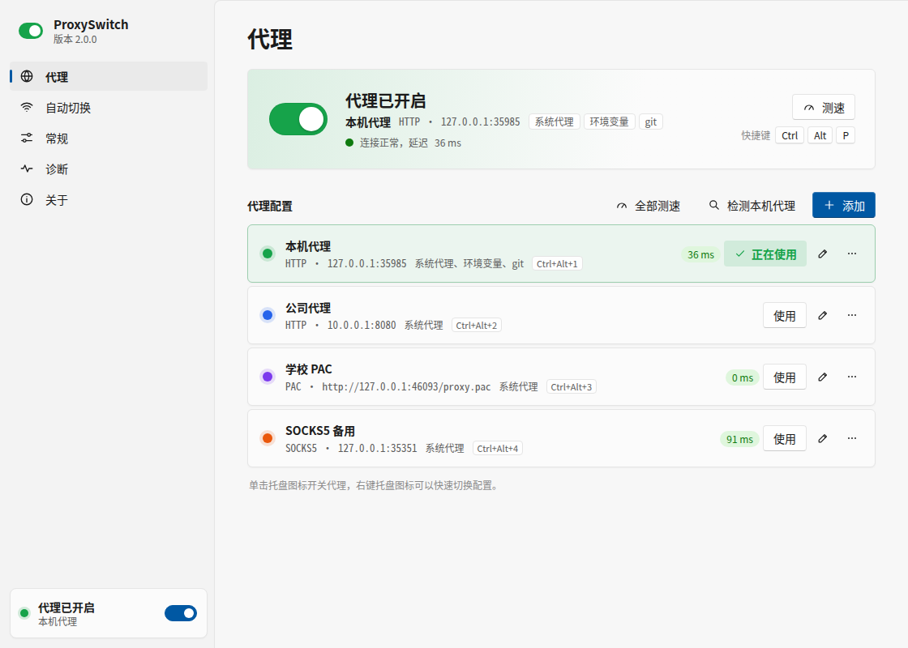
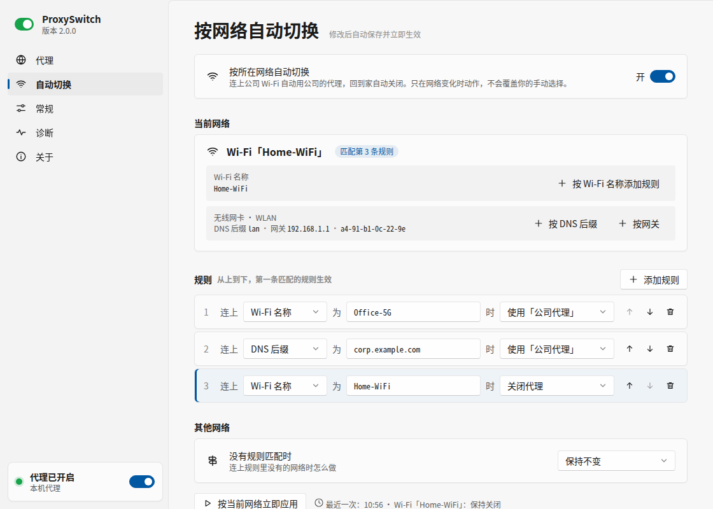
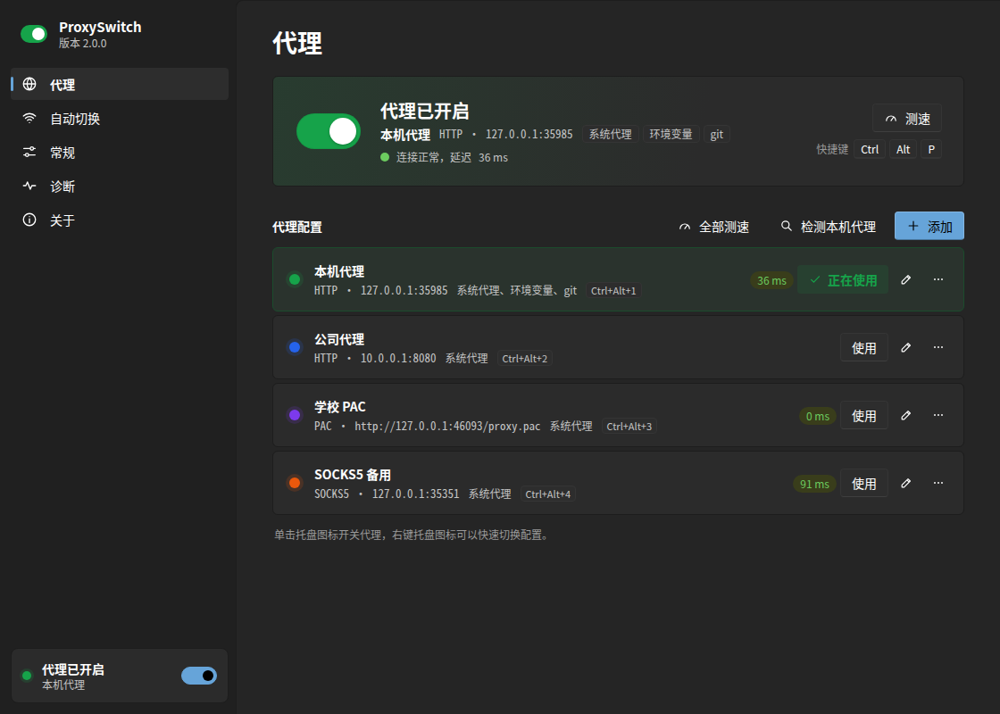

<p align="center"></p>

<h1 align="center">ProxySwitch</h1>

<p align="center">常驻任务栏托盘的 Windows 代理开关：单击开关，右键切换，按所在网络自动切换；填上机场订阅就能直接选节点上网。</p>



## 功能

- **一键开关**：单击托盘图标开关代理，或按全局快捷键（默认 `Ctrl+Alt+P`）。托盘图标就是一个开关，颜色是当前配置的颜色；代理服务器连不上时滑块变红。
- **多套配置**：右键托盘图标切换配置，也可以用 `Ctrl+Alt+数字` 直接切到第几个配置。
- **机场订阅**：填上订阅地址就能用机场的节点，不需要再装 Clash 之类的代理软件。在设置窗口或托盘菜单里选节点、测速，也可以自动选延迟最低的；按规则分流或全局代理随时切换，规则可以用内置的大陆直连，也可以用小火箭（Shadowrocket）的分流规则（黑名单、白名单、去广告等）；显示剩余流量和到期时间，每天自动更新订阅和规则。
- **自动检测本机代理**：找出正在运行的代理软件监听的端口，确认它确实能转发连接后一键添加；系统里已经设置了代理时，也可以一键保存为配置。
- **测速**：经代理实际访问一次测速地址，显示延迟；PAC 配置按脚本为测速地址选出的代理测。
- **按网络自动切换**：连上公司 Wi-Fi 自动用公司代理，回家自动关闭；也可以按 DNS 后缀或网关判断，有线网络同样适用。
- **健康检查**：代理软件没启动或崩溃时提醒你；也可以设为自动关闭代理，恢复后自动重新开启，不会因为代理挂了而上不了网。
- **生效范围**：Windows 系统代理（支持 PAC 脚本，同时设置拨号和 VPN 连接），可选用户环境变量、git、npm / pnpm。
- **终端里也能用**：环境变量只对新开的终端生效。托盘菜单和设置窗口可以复制 PowerShell、命令提示符、Git Bash 下设置代理的命令，粘贴到已经打开的终端里就能用。
- **关闭时恢复原设置**：公司电脑本来就配置了代理时，关闭后恢复成原来的样子，而不是直接断开。
- **好看好用的设置界面**：独立窗口，跟随系统的深浅色、强调色和高对比度主题，改动立即生效，不需要懂配置文件。点击托盘通知直接打开相关的设置页。
- **一键更新**：每天检查一次新版本（可以关闭），也可以随时从托盘菜单检查；有新版本时一键下载、校验并重新启动。
- **命令行**：`ProxySwitch.exe on / off / use 配置名`，托盘程序在运行时命令交给它执行，图标立即更新。
- 单个 exe，纯 Go 编写，没有第三方依赖，不需要管理员权限，不收集任何数据。提供 x64 和 ARM64 两个版本。使用机场订阅时另外下载一次代理内核，见[机场订阅](#机场订阅)。

## 安装

从 [Releases](https://github.com/whrss9527/proxyswitch/releases) 下载：

| 文件 | 适用 |
| --- | --- |
| `ProxySwitch.exe` | 绝大多数电脑（Intel / AMD 处理器） |
| `ProxySwitch-arm64.exe` | 骁龙等 ARM 处理器的 Windows 电脑 |

放到任意文件夹后双击运行，任务栏右下角会出现托盘图标。支持 Windows 10 和 Windows 11。

没有数字签名的程序第一次运行时，Windows 可能提示「Windows 已保护你的电脑」，点「更多信息」→「仍要运行」即可。

## 使用

### 第一次使用

第一次运行会自动打开设置窗口，选一种方式添加代理：

- **自动检测**：已经打开代理软件时选这个，它会列出本机可以使用的代理端口，点「添加」即可。
- **手动填写**：填代理服务器的地址和端口。本机运行的代理软件一般是 `127.0.0.1` 加它设置里的「HTTP 端口」或「混合端口」。
- **PAC 脚本**：公司或学校提供了自动配置脚本地址时选这个。
- **机场订阅**：有机场的订阅地址时选这个，见下面的[机场订阅](#机场订阅)。

保存时默认勾选「保存后立即使用」，保存完代理就开启了。

### 日常使用

- **单击**托盘图标：开关代理。
- **右键**托盘图标：切换配置、测试连接、复制终端代理命令、按网络自动切换、打开设置、开机自动启动、检查更新、退出。订阅配置有子菜单，可以选节点、全部测速、更新订阅。
- 点击托盘通知会打开相关的设置页，例如自动切换的通知打开「自动切换」页。
- 再次双击 `ProxySwitch.exe` 会打开设置窗口，不会重复启动。

单击、双击托盘图标分别做什么可以在「设置 → 常规」里修改。

### 托盘图标

| 图标 | 含义 |
| --- | --- |
| 灰色，滑块在左 | 代理已关闭 |
| 配置的颜色，滑块在右 | 代理已开启，颜色对应正在使用的配置 |
| 配置的颜色，滑块变成红点 | 代理已开启，但连不上代理服务器 |
| 橙色，滑块在右 | 系统代理是其他程序设置的，单击会关闭它 |
| 红色 | 配置文件有错误 |

### 机场订阅

填上机场给的订阅地址，就能直接用订阅里的节点，不需要再安装 Clash、v2rayN 之类的软件。

**添加**：在「设置 → 代理」里点「添加」，类型选「订阅」，粘贴订阅地址（还没有配置时，直接点「机场订阅」）。可以先点「检查订阅」，看看有多少个节点、流量和到期时间，还没填名字时会用机场给的名字。订阅可以是 Clash 配置，也可以是 base64 编码的节点链接（ss、vmess、vless、trojan、hysteria2 等）。

**分流**：和小火箭一样有两种方式，随时可以切换：

| 分流 | 说明 |
| --- | --- |
| 按规则分流（默认） | 按下面选的分流规则决定哪些网站走节点、哪些直连、哪些拦截 |
| 全局代理 | 所有网站都走节点 |

按规则分流时可以选：

- **大陆直连（内置，默认）**：国内的网站和 IP 直连，其余走节点。
- **小火箭规则**：直接选 [Shadowrocket-ADBlock-Rules-Forever](https://github.com/Johnshall/Shadowrocket-ADBlock-Rules-Forever) 的黑名单（被墙的网站走节点，其余直连）、白名单（国内和能直连的网站直连，其余走节点）、国内外划分，以及它们带去广告的版本和懒人配置。
- **自定义规则地址**：填网上分享的小火箭（Shadowrocket）或 Surge 规则配置（.conf）的地址，可以先点「检查规则」看看有多少条规则。

本机和局域网地址无论怎么选都直接连接。在托盘菜单的订阅子菜单、节点对话框或配置的「更多」菜单里都能切换按规则分流和全局代理。

**第一次使用**时要下载代理内核。ProxySwitch 用 [mihomo](https://github.com/MetaCubeX/mihomo)（Clash.Meta）内核连接节点，设置窗口会提示「下载内核」，约 20 MB，只需下载一次。下载的是 mihomo 官方发布的固定版本，按写在 ProxySwitch 里的 SHA-256 校验后才使用。内置的大陆直连（以及用到 GEOIP 的规则）还要下载一次国内域名和 IP 的数据（约 12 MB），下载好之前暂时全部走节点。

**选节点**：点订阅配置上的「节点」按钮，或者右键托盘图标，在订阅配置的子菜单里选。「自动选择」每半小时测一次速，使用延迟最低的节点；「全部测速」立即测一遍并显示每个节点的延迟。选中的节点会保存下来，下次启动继续使用。

**更新订阅**：每天自动更新一次，失败时一小时后重试，期间继续使用上次下载的节点；也可以点「更新订阅」立即更新。机场提供了流量和到期信息时，配置列表里会显示，流量快用完或快到期时会标出来。

**分流规则**也每天更新一次，也可以在「更多」菜单或托盘菜单里点「更新分流规则」。规则配置里 `RULE-SET`、`DOMAIN-SET` 引用的规则列表（Surge、QuantumultX、Clash 格式）一起下载，某个列表下载失败时用上次下载的；规则还没下载好或下载失败时，暂时按大陆直连分流。规则一般放在 GitHub 上，有代理时先经代理下载。

<details>
<summary>支持哪些规则</summary>

- `[Rule]` 里的 `DOMAIN`、`DOMAIN-SUFFIX`、`DOMAIN-KEYWORD`、`DOMAIN-WILDCARD`、`DOMAIN-REGEX`、`IP-CIDR`、`IP-CIDR6`、`GEOIP`、`DST-PORT`、`RULE-SET`、`DOMAIN-SET`、`FINAL`，规则列表里 QuantumultX 写法的 `HOST`、`HOST-SUFFIX`、`IP6-CIDR` 等也能识别。
- 去向：`PROXY` 走选中的节点，`DIRECT` 直连，`REJECT`（包括 `REJECT-TINYGIF` 等）拦截。`[Proxy Group]` 里的策略组按它的默认选项（`policy-select-name`，没有写时是第一个选项）归为这三种之一，节点和自动测速的组都算走节点。
- `USER-AGENT`、`URL-REGEX` 这类要解密 HTTPS 才能判断的规则，以及 `IP-ASN`、`PROCESS-NAME`、`AND` / `OR` 等内核做不到的规则会跳过，列表里能看到跳过了多少条；`[General]`、`[URL Rewrite]`、`[MITM]`、`[Host]` 等段落不使用。
- 去广告的规则有几万条，ProxySwitch 会把去向相同的连续规则合并成内核的规则集，按域名前缀树匹配，不会拖慢上网。

</details>

ProxySwitch 在后台运行 mihomo 内核，内核在 `127.0.0.1:17890` 提供代理（HTTP 和 SOCKS5 共用这个端口）。开启订阅配置，就是把系统代理和勾选的环境变量、git、npm 指向这个端口，所以按网络自动切换、快捷键、健康检查、终端代理命令对订阅配置同样适用。端口和内核程序的位置可以在「设置 → 常规 → 代理内核」里修改。

注意：

- 内核由 ProxySwitch 管理，跟着它启动和退出。退出 ProxySwitch 时会关闭订阅配置的代理，否则系统代理指向的端口没有程序在听，就上不了网了；「启动时」设为「保持上次的状态」（默认）时，下次启动会自动重新开启。
- 托盘程序没有运行时，命令行不能开启订阅配置。
- 暂不支持 TUN 模式：不使用系统代理的程序（例如部分游戏）不会经过节点，可以在这些程序里把代理设为 `127.0.0.1:17890`。
- 暂不使用机场订阅里自带的分流规则（Clash 配置里的 `rules`），可以改选小火箭规则。
- 从 Clash 等软件换过来时，先别急着关掉它：内核和订阅可以经它设置的系统代理下载。用上订阅以后，把它的「系统代理」关掉或者卸载它，避免和 ProxySwitch 互相覆盖。

### 按网络自动切换

在「设置 → 自动切换」里打开，然后添加规则。「当前网络」里列出了现在连接的 Wi-Fi 名称、DNS 后缀和网关，点旁边的按钮就能按当前网络添加规则。

- 规则从上到下匹配，第一条匹配的生效；都不匹配时按「其他网络」的设置处理。
- 只在网络变化时切换。你在某个网络里手动切换后，它不会再改回去，直到你换了网络。
- Windows 11 24H2 起读取 Wi-Fi 名称需要打开「位置」权限。没打开时 ProxySwitch 会根据网关从系统记录的网络列表里找出 Wi-Fi 名称；也可以改用 DNS 后缀或网关作为条件，这两种不需要权限。



### 在已经打开的终端里使用代理

环境变量写入后只有新开的终端能看到。代理开启时，右键托盘图标选「复制终端代理命令」，或者在设置窗口的开启卡片上点「终端命令」，选择终端类型，把复制的命令粘贴到终端里回车即可：

| 终端 | 复制的命令 |
| --- | --- |
| PowerShell | `$env:HTTP_PROXY='http://127.0.0.1:7890'; $env:HTTPS_PROXY=…; $env:NO_PROXY=…` |
| 命令提示符（CMD） | `set "HTTP_PROXY=http://127.0.0.1:7890" & set "HTTPS_PROXY=…" & set "NO_PROXY=…"` |
| Git Bash | `export http_proxy=… https_proxy=… no_proxy=… HTTP_PROXY=… HTTPS_PROXY=… NO_PROXY=…` |

Git Bash 的命令也能用在 WSL 里。注意 WSL 2 默认的网络模式下 `127.0.0.1` 指的是 WSL 自己，要把地址换成 Windows 的 IP；开启镜像网络模式后可以直接用。

### 快捷键

- 开关代理：默认 `Ctrl+Alt+P`，在「设置 → 常规」里点一下快捷键框，按下新的组合即可修改。
- 按数字切换配置：选择修饰键后，例如 `Ctrl+Alt+1` 切到第 1 个配置，再按一次关闭代理。

快捷键被其他程序占用时会有提示，换一个组合即可。

### 命令行

```
ProxySwitch.exe on              开启代理（上次使用的配置）
ProxySwitch.exe off             关闭代理
ProxySwitch.exe toggle          开 / 关切换
ProxySwitch.exe use 公司代理     切换到指定配置并开启
ProxySwitch.exe status          查看状态（退出码 0 表示已开启，1 表示已关闭）
ProxySwitch.exe settings        打开设置
```

托盘程序在运行时，命令交给它执行；没有运行时直接修改设置后退出。可以用在脚本、计划任务或桌面快捷方式里。

## 更新

右键托盘图标选「检查更新」，会打开「设置 → 关于」并立即检查；也可以在「关于」页里点「检查更新」。有新版本时点「立即更新」：下载本机对应的 exe，用发布附带的 SHA256SUMS.txt 校验，替换后自动重新启动，设置和代理配置都会保留。

默认每天自动检查一次，发现新版本时在托盘提示一次，托盘菜单里的这一项也会变成「更新到 x.y.z」，不会自动安装。不想自动检查可以在「关于」页关闭。程序放在需要管理员权限才能写入的文件夹（例如 `C:\Program Files`）时无法直接替换，按提示到发布页下载即可。

GitHub 的接口对未登录的访问限制了次数（每个 IP 每小时 60 次），公司网络、代理服务器的出口 IP 很多人共用，容易超过。这时改从发布页查找新版本，同样可以一键更新，只是看不到更新说明，可以点「查看发布页」。

1.x 版本还没有程序内更新，从 1.x 升级时到 [Releases](https://github.com/whrss9527/proxyswitch/releases) 下载新版本替换一次 exe 即可，原来的配置文件可以直接使用。

## 深色模式和高对比度

设置窗口和托盘菜单都跟随系统的深浅色，也可以在「设置 → 常规 → 外观」里固定为浅色或深色。开启 Windows 的高对比度主题时，设置窗口改用系统的高对比度颜色。



## 配置文件

一般不需要手改，设置窗口里的修改会立即保存。想手改时在「设置 → 常规 → 配置文件」里点「编辑」，保存后几秒内自动生效；文件有错误时会提示，并继续使用修改前的配置。

| 模式 | 位置 |
| --- | --- |
| 安装模式（默认） | `%APPDATA%\ProxySwitch\`：配置 `config.jsonc`、运行状态 `state.json`、日志 `proxyswitch.log`、崩溃记录 `crash.log`；`core` 文件夹里是代理内核、下载的订阅和分流规则、内核的日志 `core.log` |
| 便携模式 | exe 所在的文件夹。只要 exe 旁边有 `config.jsonc`，所有文件都放在这里，适合放在 U 盘里用 |

配置文件是 JSON，允许 `//` 注释和末尾多余的逗号。第一次运行生成的文件里每一项都有注释说明。

<details>
<summary>全部字段</summary>

| 字段 | 取值 | 说明 |
| --- | --- | --- |
| `hotkey` | 例如 `Ctrl+Alt+P` | 开关代理的快捷键，留空不注册 |
| `profile_hotkeys` | 例如 `Ctrl+Alt` | 按数字切换配置的修饰键，留空不启用 |
| `notify_level` | `all` / `errors` / `none` | 显示全部通知 / 只显示问题 / 不显示 |
| `notify_seconds` | 0~60 | 通知几秒后自动消失，0 由系统决定 |
| `startup_action` | `keep` / `on` / `off` | 启动时保持状态 / 自动开启 / 自动关闭 |
| `off_mode` | `direct` / `restore` | 关闭代理时直接连接 / 恢复开启前的系统代理设置 |
| `disable_on_exit` | `true` / `false` | 退出程序（包括关机、注销）时关闭代理 |
| `health_check` | `notify` / `auto_off` / `off` | 代理服务器连不上时提醒 / 自动关闭并在恢复后重新开启 / 不检查 |
| `tray_click` | `toggle` / `settings` / `menu` | 单击托盘图标的动作 |
| `tray_double_click` | `none` / `settings` / `toggle` | 双击托盘图标的动作 |
| `theme` | `system` / `light` / `dark` | 设置窗口的颜色 |
| `settings_window` | `app` / `browser` | 设置界面用独立窗口还是默认浏览器打开 |
| `test_url` | 网址 | 测速时经代理访问的地址 |
| `editor` | 程序名 | 编辑配置文件用的编辑器，留空用记事本 |
| `check_updates` | `true` / `false` | 每天自动检查一次新版本 |
| `core` | 见下 | 订阅使用的代理内核 |
| `auto_switch` | 见下 | 按网络自动切换 |
| `profiles` | 见下 | 代理配置，托盘菜单按这个顺序显示 |

`profiles` 里每个配置：

| 字段 | 说明 |
| --- | --- |
| `name` | 名字，不能重复 |
| `color` | 颜色 `#rrggbb`，托盘图标和设置界面用它区分配置 |
| `server` | 代理地址：`127.0.0.1:7890`、`socks5://127.0.0.1:1080`，或按协议分别指定 `http=主机:端口;https=主机:端口;socks=主机:端口` |
| `pac` | PAC 脚本地址，填了就以 PAC 方式开启系统代理 |
| `bypass` | 系统代理的例外，分号分隔，`*` 是通配符，`<local>` 表示不含点的内网名称；留空时包含本机和局域网地址 |
| `no_proxy` | 环境变量和 npm 的 NO_PROXY，逗号分隔 |
| `apply_to` | 生效范围：`system` 系统代理、`env` 环境变量、`git`、`npm`。环境变量、git、npm 不能使用 PAC，npm 不支持 SOCKS5 |
| `subscription` | 机场的订阅地址。填了就由代理内核连接订阅里的节点，`server` 由程序自动填成内核的端口 |
| `node` | 订阅配置选中的节点名字，留空自动选择延迟最低的 |
| `mode` | 订阅配置的分流：`rule` 按规则分流 / `global` 全局代理 |
| `rules` | 按规则分流时用的小火箭（Shadowrocket）规则配置的地址，留空用内置的大陆直连 |

`auto_switch`：

| 字段 | 说明 |
| --- | --- |
| `enabled` | 是否启用 |
| `rules` | 规则列表，每条 `{"match": "ssid" / "dns_suffix" / "gateway", "value": "…", "action": "use" / "off", "profile": "配置名"}` |
| `default_action` | 没有规则匹配时：`keep` 保持不变、`off` 关闭代理、`use` 使用 `default_profile` |

`core`：

| 字段 | 说明 |
| --- | --- |
| `path` | mihomo 程序的位置，留空使用 ProxySwitch 下载的内核 |
| `port` | 内核在本机提供代理的端口，默认 `17890`，HTTP 和 SOCKS5 共用 |

</details>

从 1.x 升级时，原来的配置文件可以直接使用。

## 常见问题

**设置窗口是在浏览器里打开的？**
设置界面优先用 Edge 或 Chrome 的应用模式打开成独立窗口（Windows 10 / 11 都自带 Edge），使用单独的数据目录，不影响你自己的浏览器。都没有时用默认浏览器打开。

**改了代理，某个程序还是没走代理？**
大多数程序跟随系统代理，但也有程序只认自己的设置。命令行工具看环境变量：已经打开的终端不会感知变化，需要新开一个，或者用「复制终端代理命令」在当前终端里设置。

**公司电脑上改了没效果？**
管理员可能通过组策略把代理设置锁定为按计算机统一设置，这时当前用户的设置不会生效。ProxySwitch 写入后会读回确认，出现这种情况会提示，「设置 → 诊断」里也能看到。

**连着 VPN 时代理不生效？**
Windows 的拨号和 VPN 连接各有一份代理设置。ProxySwitch 开关代理时会同时设置它们，新建 VPN 连接后重新开关一次即可。

**其他代理软件也在管系统代理？**
两边会互相覆盖。建议在那些软件里关闭「自动设置系统代理」，只用 ProxySwitch 开关。ProxySwitch 发现系统代理被其他程序改掉时，托盘图标会变成橙色。

**上不了网，也不知道是哪里的代理设置在起作用？**
打开「设置 → 诊断」，可以看到系统代理、环境变量、git、npm 的当前设置；「清除所有代理设置」会把它们全部恢复为直接连接。

**没有弹出通知？**
Windows 的「专注助手 / 免打扰」会拦截通知。通知的显示范围和时长在「设置 → 常规 → 通知」里修改。

**被杀毒软件误报？**
Go 编写的小工具偶尔会被误报。可以核对 Release 附带的 SHA256SUMS.txt，或者自己从源码编译。

**会联网吗？**
只在测速（访问测速地址）和检查更新（访问 GitHub）时联网，不收集任何数据。代理开启时这些请求经代理发出。自动检查更新可以在「设置 → 关于」里关闭。使用机场订阅时还会下载订阅和选用的分流规则（每天一次）、代理内核（GitHub，只下载一次）和大陆直连用的数据（jsDelivr 或 GitHub，只下载一次）。

**代理内核下载不下来？**
内核从 GitHub 下载，国内直接连接常常很慢。有代理时 ProxySwitch 先经代理下载：正在使用的配置，或者原来的代理软件（例如 Clash）设置的系统代理都可以，所以换过来时先别急着关掉原来的软件。也可以自己从 [mihomo 的发布页](https://github.com/MetaCubeX/mihomo/releases) 下载 `mihomo-windows-amd64-v1-版本号.zip`（ARM 电脑下载 `arm64` 的），解压后在「设置 → 常规 → 代理内核」里填程序的位置。

**订阅配置提示端口被占用？**
内核默认使用 `17890` 端口，被其他程序占用时在「设置 → 常规 → 代理内核」里换一个端口。

**程序意外退出了？**
崩溃时的信息会记录下来，下次启动时托盘会提示，「设置 → 诊断」里能看到记录。反馈问题时附上「复制诊断信息」的内容会更快解决。

**怎么卸载？**
先在「设置 → 诊断」里点「清除所有代理设置」，在「设置 → 常规」里关闭开机自动启动，然后从托盘菜单退出，删除 exe 和 `%APPDATA%\ProxySwitch` 文件夹（便携模式是 exe 旁边的文件）。设置窗口的浏览器数据在 `%LOCALAPPDATA%\ProxySwitch`，也可以一并删除。

## 开发

需要 Go 1.23 或更新版本，不需要 CGO。在 Linux / macOS 上交叉编译：

```bash
make              # 编译 dist/ProxySwitch.exe 和 dist/ProxySwitch-arm64.exe
make test         # 静态检查（含 Windows 平台）和单元测试
make dev          # 在本机预览设置界面，系统设置用内存模拟，带假的代理和测速地址
make dev CORE=/path/to/mihomo   # 同上，用本机的 mihomo 试用机场订阅
make ui-test      # 设置界面的浏览器自动化测试（需要 Python Playwright）
```

订阅和代理内核的测试需要真实的 mihomo，设置 `PROXYSWITCH_CORE` 为它的路径才会运行，例如 `PROXYSWITCH_CORE=/path/to/mihomo make test`；CI 会下载 `core_config.go` 里固定版本的官方内核来跑。

在 Windows 上编译：

```bat
go build -trimpath -ldflags="-H windowsgui -s -w" -o ProxySwitch.exe .
```

代码结构：

| 文件 | 内容 |
| --- | --- |
| `engine.go` | 核心逻辑：状态判断、开关与切换、配置变更后重新应用、健康检查、按网络自动切换，与平台无关，在 Linux 上测试 |
| `config.go` `jsonc.go` | 配置文件的解析、校验和保存 |
| `probe.go` | 本机代理检测和测速 |
| `update.go` | 检查更新、下载并校验新版本 |
| `subscription.go` `subscription_service.go` | 订阅的下载、格式识别和流量信息，后台定时更新；设置界面上的订阅操作 |
| `rules.go` | 分流规则：解析小火箭 / Surge 的规则配置和引用的规则列表，转换成内核的规则和规则集 |
| `core.go` `core_config.go` `coreinstall.go` `engine_core.go` | 代理内核（mihomo）：生成配置、启动和监控进程、通过它的接口选节点和测速；下载并校验内核；与引擎的衔接 |
| `terminal.go` | 在当前终端设置代理的命令 |
| `settings.go` `web/` | 设置界面的本地服务和页面 |
| `*_windows.go` | Windows 实现：系统代理（WinINET）、PAC 执行（WinHTTP）、托盘、菜单、通知、快捷键、网络信息、监听端口、替换程序完成更新、内核进程随 ProxySwitch 退出（作业对象） |
| `settings_dev.go` `dev_fakes.go` `memorysystem.go` | 开发模式和测试用的内存实现、假代理 |

推送代码时 GitHub Actions 会在 Linux 上跑单元测试和界面测试，在 Windows 上跑包括读写系统代理在内的全部测试；推送 `v*` 标签会自动编译并发布 Release。发布时下载固定版本的官方内核，把它的 SHA-256 写进程序（`make core-sha256` 可以在本地算出这两个值），程序里下载内核时按它校验。

## 许可证

[MIT](LICENSE)

机场订阅使用的 [mihomo](https://github.com/MetaCubeX/mihomo) 是 GPL-3.0 许可的独立程序。ProxySwitch 不包含它的代码，只在需要时从它的官方发布下载，作为单独的进程运行。
