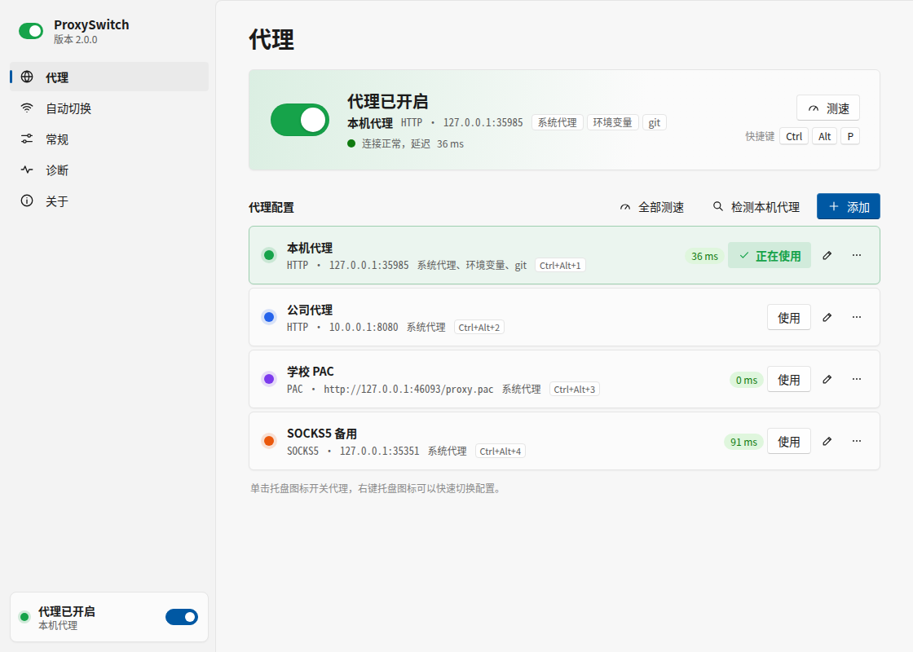
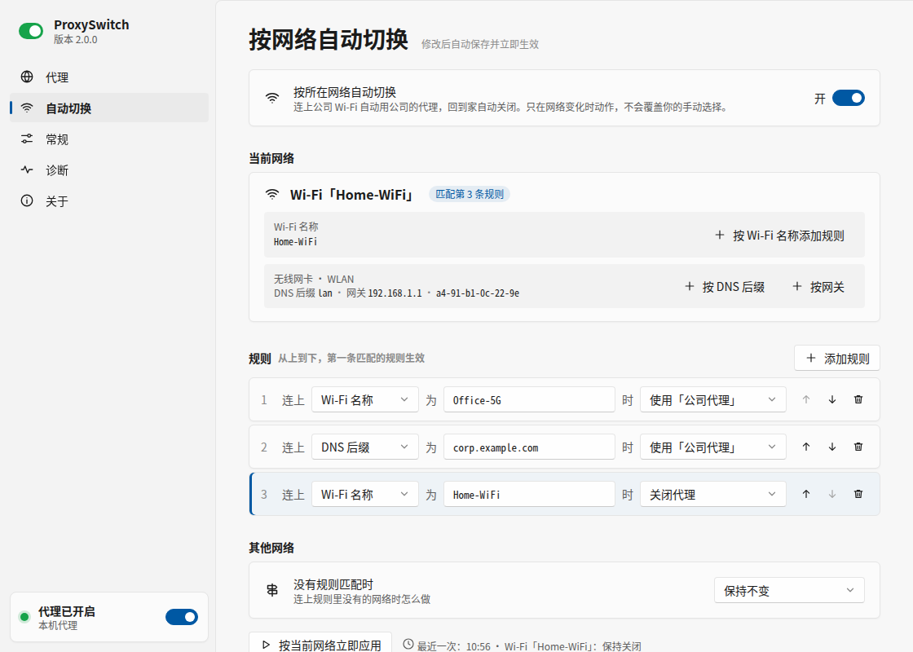
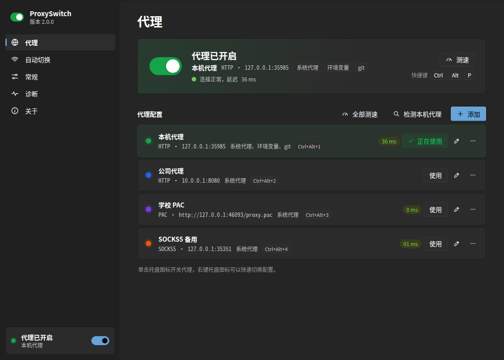
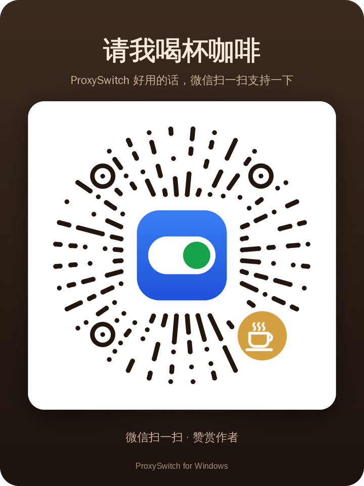

<p align="center"></p>

<h1 align="center">ProxySwitch</h1>

<p align="center">常驻任务栏托盘的 Windows 代理开关：单击开关，右键切换，按所在网络自动切换；填上机场订阅就能直接选节点上网。</p>



## 功能

- **一键开关**：单击托盘图标开关代理，或按全局快捷键（默认 `Ctrl+Alt+P`）。托盘图标就是一个开关，颜色是当前配置的颜色；代理服务器连不上时滑块变红。
- **多套配置**：右键托盘图标切换配置，也可以用 `Ctrl+Alt+数字` 直接切到第几个配置。
- **机场订阅**：填上订阅地址就能用机场的节点，不需要再装 Clash 之类的代理软件。在设置窗口或托盘菜单里选节点、测速，也可以自动选延迟最低的；按规则分流或全局代理随时切换，规则可以用内置的大陆直连，也可以用小火箭（Shadowrocket）的分流规则（黑名单、白名单、去广告等），还可以用自定义规则让某个网站或程序固定走节点、直连或拦截；可以建「流媒体」「Telegram」这样的策略组给某类流量单独选节点（手动选择、自动选择、故障转移、负载均衡）；显示剩余流量和到期时间，每天自动更新订阅和规则。
- **局域网共享**：让 PS5、Switch、手机这些同一局域网里的设备把这台电脑当代理服务器，和本机用同样的节点和分流规则；本机用其他代理时转发给它。能看到哪些设备在用、访问了什么网站、走了哪个节点，共享期间不让电脑睡眠。
- **网址诊断**：某个网站打不开时，把链路走一遍——本机代理、域名解析、直连、经代理（命中了哪条规则、走了哪个节点）、节点——告诉你卡在哪，一键修复（让它走节点、换节点、开启订阅……）。
- **自动检测本机代理**：找出正在运行的代理软件监听的端口，确认它确实能转发连接后一键添加；系统里已经设置了代理时，也可以一键保存为配置。
- **测速**：经代理实际访问一次测速地址，显示延迟；PAC 配置按脚本为测速地址选出的代理测。
- **按网络自动切换**：连上公司 Wi-Fi 自动用公司代理，回家自动关闭；也可以按 DNS 后缀或网关判断，有线网络同样适用。
- **健康检查**：代理软件没启动或崩溃时提醒你；也可以设为自动关闭代理，恢复后自动重新开启，不会因为代理挂了而上不了网。
- **微软商店应用也能走代理**：商店、邮件、Xbox 等应用默认连不上本机的代理，一键允许后就能用。
- **系统服务也能走代理**：Windows 更新、Microsoft Store 的下载等系统服务用的 WinHTTP 代理，一键设为当前代理或改回直连。
- **WSL 也能走代理**：一键把 WSL 设成镜像网络并自动使用 Windows 的代理，WSL 里的 `apt`、`git`、`curl` 也走本机的代理。
- **TUN 模式**：游戏、命令行工具这些不认系统代理的程序也走订阅的节点和分流规则。
- **实时网速**：托盘图标的提示和设置窗口的开关卡片上显示上传、下载速度，可以选看整台电脑的网速或只看内置代理的。
- **生效范围**：Windows 系统代理（支持 PAC 脚本，同时设置拨号和 VPN 连接），可选用户环境变量、git、npm / pnpm。
- **终端里也能用**：环境变量只对新开的终端生效。托盘菜单和设置窗口可以复制 PowerShell、命令提示符、Git Bash 下设置代理的命令，粘贴到已经打开的终端里就能用。
- **关闭时恢复原设置**：公司电脑本来就配置了代理时，关闭后恢复成原来的样子，而不是直接断开。
- **好看好用的设置界面**：独立窗口，跟随系统的深浅色、强调色和高对比度主题，改动立即生效，不需要懂配置文件。点击托盘通知直接打开相关的设置页。
- **通知带按钮**：发现新版本时在通知上「立即更新」，代理服务器连不上时「关闭代理」，订阅下载好了「开启」；带按钮的通知留在通知中心，过后还能点。
- **一键更新**：每天检查一次新版本（可以关闭），也可以随时从托盘菜单检查；有新版本时一键下载、校验并重新启动。
- **命令行和链接**：`ProxySwitch.exe on / off / use 配置名`，或者 `proxyswitch://toggle` 这样的链接；托盘程序在运行时命令交给它执行，图标立即更新。机场网站的「一键导入 Clash」直接打开 ProxySwitch 添加订阅。
- 单个 exe，纯 Go 编写，没有第三方依赖，不需要管理员权限，不收集任何数据。提供 x64 和 ARM64 两个版本。使用机场订阅时另外下载一次代理内核，见[机场订阅](#机场订阅)。

## 安装

从 [Releases](https://github.com/whrss9527/proxyswitch/releases) 下载：

| 文件 | 适用 |
| --- | --- |
| `ProxySwitch.exe` | 绝大多数电脑（Intel / AMD 处理器） |
| `ProxySwitch-arm64.exe` | 骁龙等 ARM 处理器的 Windows 电脑 |

放到任意文件夹后双击运行，任务栏右下角会出现托盘图标。支持 Windows 10 和 Windows 11。

没有数字签名的程序第一次运行时，Windows 可能提示「Windows 已保护你的电脑」，点「更多信息」→「仍要运行」即可。

## 使用

### 第一次使用

第一次运行会自动打开设置窗口，选一种方式添加代理：

- **自动检测**：已经打开代理软件时选这个，它会列出本机可以使用的代理端口，点「添加」即可。
- **手动填写**：填代理服务器的地址和端口。本机运行的代理软件一般是 `127.0.0.1` 加它设置里的「HTTP 端口」或「混合端口」。
- **PAC 脚本**：公司或学校提供了自动配置脚本地址时选这个。
- **机场订阅**：有机场的订阅地址时选这个，见下面的[机场订阅](#机场订阅)。

保存时默认勾选「保存后立即使用」，保存完代理就开启了。

### 日常使用

- **单击**托盘图标：开关代理。
- **右键**托盘图标：切换配置、测试连接、网址诊断、复制终端代理命令、按网络自动切换、局域网共享、打开设置、开机自动启动、检查更新、退出。订阅配置有子菜单，可以选节点、全部测速、更新订阅。
- 点击通知会打开相关的设置页，例如自动切换的通知打开「自动切换」页。有的通知带按钮，例如发现新版本时的「立即更新」、代理服务器连不上时的「关闭代理」。
- 再次双击 `ProxySwitch.exe` 会打开设置窗口，不会重复启动。

单击、双击托盘图标分别做什么可以在「设置 → 常规」里修改。

### 托盘图标

| 图标 | 含义 |
| --- | --- |
| 灰色，滑块在左 | 代理已关闭 |
| 配置的颜色，滑块在右 | 代理已开启，颜色对应正在使用的配置 |
| 配置的颜色，滑块变成红点 | 代理已开启，但连不上代理服务器 |
| 橙色，滑块在右 | 系统代理是其他程序设置的，单击会关闭它 |
| 红色 | 配置文件有错误 |

### 机场订阅

填上机场给的订阅地址，就能直接用订阅里的节点，不需要再安装 Clash、v2rayN 之类的软件。

**添加**：在「设置 → 代理」里点「添加」，类型选「订阅」，粘贴订阅地址（还没有配置时，直接点「机场订阅」）；也可以直接点机场网站上的「一键导入 Clash」，见[网页链接和一键导入](#网页链接和一键导入)。可以先点「检查订阅」，看看有多少个节点、流量和到期时间，还没填名字时会用机场给的名字。订阅可以是 Clash 配置，也可以是 base64 编码的节点链接（ss、vmess、vless、trojan、hysteria2 等）。

订阅也可以是本机的文件（例如自己整理的节点列表）：在订阅地址里填完整的路径，如 `C:\节点\sub.yaml` 或 `\\NAS\共享\sub.yaml`，保存时换成 `file:///C:/节点/sub.yaml` 这样的地址。文件改了之后 10 分钟内自动重新读取，点「更新订阅」立即读取。

**分流**：和小火箭一样有两种方式，随时可以切换：

| 分流 | 说明 |
| --- | --- |
| 按规则分流（默认） | 按下面选的分流规则决定哪些网站走节点、哪些直连、哪些拦截 |
| 全局代理 | 所有网站都走节点 |

按规则分流时可以选：

- **大陆直连（内置，默认）**：国内的网站和 IP 直连，其余走节点。
- **小火箭规则**：直接选 [Shadowrocket-ADBlock-Rules-Forever](https://github.com/Johnshall/Shadowrocket-ADBlock-Rules-Forever) 的黑名单（被墙的网站走节点，其余直连）、白名单（国内和能直连的网站直连，其余走节点）、国内外划分，以及它们带去广告的版本和懒人配置。
- **自定义规则地址**：填网上分享的小火箭（Shadowrocket）、Surge 规则配置（.conf）或 Clash 配置（.yaml，用其中的 `rules`）的地址，可以先点「检查规则」看看有多少条规则。

本机和局域网地址无论怎么选都直接连接。在托盘菜单的订阅子菜单、节点对话框或配置的「更多」菜单里都能切换按规则分流和全局代理。

**第一次使用**时要下载代理内核。ProxySwitch 用 [mihomo](https://github.com/MetaCubeX/mihomo)（Clash.Meta）内核连接节点，设置窗口会提示「下载内核」，约 20 MB，只需下载一次。下载的是 mihomo 官方发布的固定版本，按写在 ProxySwitch 里的 SHA-256 校验后才使用。内置的大陆直连（以及用到 GEOIP 的规则）还要下载一次国内域名和 IP 的数据（约 12 MB），下载好之前暂时全部走节点。

**选节点**：点订阅配置上的「节点」按钮，或者右键托盘图标，在订阅配置的子菜单里选。「自动选择」每半小时测一次速，使用延迟最低的节点；「全部测速」立即测一遍并显示每个节点的延迟。选中的节点会保存下来，下次启动继续使用。

**更新订阅**：每天自动更新一次，失败时一小时后重试，期间继续使用上次下载的节点；也可以点「更新订阅」立即更新。机场提供了流量和到期信息时，配置列表里会显示，流量快用完或快到期时会标出来。

**分流规则**也每天更新一次，也可以在「更多」菜单或托盘菜单里点「更新分流规则」。规则配置里 `RULE-SET`、`DOMAIN-SET` 引用的规则列表（Surge、QuantumultX、Clash 格式）一起下载，某个列表下载失败时用上次下载的；规则还没下载好或下载失败时，暂时按大陆直连分流。规则一般放在 GitHub 上，有代理时先经代理下载。

<details>
<summary>支持哪些规则</summary>

- `[Rule]` 里的 `DOMAIN`、`DOMAIN-SUFFIX`、`DOMAIN-KEYWORD`、`DOMAIN-WILDCARD`、`DOMAIN-REGEX`、`IP-CIDR`、`IP-CIDR6`、`GEOIP`、`DST-PORT`、`RULE-SET`、`DOMAIN-SET`、`FINAL`，规则列表里 QuantumultX 写法的 `HOST`、`HOST-SUFFIX`、`IP6-CIDR` 等也能识别。
- 去向：`PROXY` 走选中的节点，`DIRECT` 直连，`REJECT`（包括 `REJECT-TINYGIF` 等）拦截。`[Proxy Group]` 里的策略组按它的默认选项（`policy-select-name`，没有写时是第一个选项）归为这三种之一，节点和自动测速的组都算走节点。
- `USER-AGENT`、`URL-REGEX` 这类要解密 HTTPS 才能判断的规则，以及 `IP-ASN`、`AND` / `OR` 等内核做不到的规则会跳过（`PROCESS-NAME`、`PROCESS-PATH` 按连接来自的程序匹配），列表里能看到跳过了多少条；`[General]`、`[URL Rewrite]`、`[MITM]`、`[Host]` 等段落不使用。
- Clash（mihomo）的配置用其中的 `rules`：`proxy-groups` 里的策略组按第一个选项归类，`RULE-SET` 引用的 `rule-providers`（domain、ipcidr、classical，yaml 或 text 格式，也支持 inline）一起下载，`GEOSITE` 规则原样交给内核；mrs 格式的规则集和 `PASS` 跳过。
- 去广告的规则有几万条，ProxySwitch 会把去向相同的连续规则合并成内核的规则集，按域名前缀树匹配，不会拖慢上网。

</details>

**自定义规则**：在「设置 → 代理」下方的「自定义规则」里，可以让某个网站固定走节点、直连或拦截，例如让规则里没有的网站走节点、让公司内网直连。填域名（包括它的子域名，粘贴网址也行，会自动整理成域名）或者 IP / 网段。自定义规则排在分流规则前面，全局代理时也生效；可以暂时停用某一条。

**策略组**：给某类流量单独选节点，相当于 Quantumult X 的策略组（policy）。在「设置 → 代理」的「策略组」里点「添加策略组」，填名字（例如「流媒体」）、选类型、填节点名的筛选（正则表达式，不区分大小写，例如 `港|HK`；留空为全部节点，编辑时能预览筛到哪些节点），然后在自定义规则的去向里选「走「流媒体」」，这些网站就按这个组走。

| 类型 | 说明 | Quantumult X 里叫 |
| --- | --- | --- |
| 手动选择 | 在设置页的下拉框或托盘菜单的「策略组」子菜单里自己选；除了筛出来的节点，还可以选「跟随节点」（和正在使用的配置选中的节点一样，默认）、「自动选择」和直连 | static |
| 自动选择 | 定期测延迟，用最低的 | url-latency-benchmark |
| 故障转移 | 按顺序用第一个能用的节点，坏了自动换下一个 | available |
| 负载均衡 | 筛出来的节点轮流用 | round-robin |

策略组的节点来自正在使用的订阅配置（用的不是订阅时来自第一个订阅），换订阅后跟着换；手动选择的组选中的节点会保存下来，换回来时继续使用，节点不在组里时跟随节点。一个节点都没筛到时，自动挑选的组暂时直连。删掉策略组后，指向它的自定义规则改为走节点；改名时跟着改。

**TUN 模式（虚拟网卡）**：游戏、部分命令行工具、Discord 语音这类程序不看系统代理。在「设置 → 常规 → 代理内核」或托盘菜单里打开「TUN 模式」后，开着订阅配置时内核会建一块虚拟网卡，接管这台电脑的全部流量，这些程序也走节点和分流规则；代理关掉或换成别的配置时虚拟网卡随之关掉。

- 建虚拟网卡要管理员权限：内核启动时会弹出一次用户账户控制的确认框（开机自启时也会），点「否」时照常用系统代理，TUN 先不开，把 TUN 模式关掉再打开可以重新确认。内核以管理员权限运行期间开关 TUN 不用再确认。
- DNS 用 fake-ip：分流规则按域名判断，走节点的网站由节点解析，直连的网站用国内的 DoH 解析；局域网、系统联网检测、游戏机和时间同步的域名照常返回真实地址。
- 以管理员权限运行的只有 ProxySwitch 自己和内核：发布版会先按发布时写入的 SHA-256 校验下载的内核，不一致就不运行（配置里指定的内核不校验）。

自定义规则也可以按程序写：类型选「程序」，填程序名（例如 `WeChat.exe`，输入时可以从正在运行的程序里选；没写 `.exe` 会自动补上）或程序的完整路径，这个程序的连接就固定走节点、直连或拦截，例如让游戏和微信直连、让 Telegram 走节点。

ProxySwitch 在后台运行 mihomo 内核，内核在 `127.0.0.1:17890` 提供代理（HTTP 和 SOCKS5 共用这个端口）。开启订阅配置，就是把系统代理和勾选的环境变量、git、npm 指向这个端口，所以按网络自动切换、快捷键、健康检查、终端代理命令对订阅配置同样适用。端口和内核程序的位置可以在「设置 → 常规 → 代理内核」里修改。

注意：

- 内核由 ProxySwitch 管理，跟着它启动和退出。退出 ProxySwitch 时会关闭订阅配置的代理，否则系统代理指向的端口没有程序在听，就上不了网了；「启动时」设为「保持上次的状态」（默认）时，下次启动会自动重新开启。
- 托盘程序没有运行时，命令行不能开启订阅配置。
- 不使用系统代理的程序（例如部分游戏）不会经过节点：打开上面的 TUN 模式，或者在这些程序里把代理设为 `127.0.0.1:17890`。
- 暂不使用机场订阅里自带的分流规则（Clash 配置里的 `rules`），可以改选小火箭规则。
- 从 Clash 等软件换过来时，先别急着关掉它：内核和订阅可以经它设置的系统代理下载。用上订阅以后，把它的「系统代理」关掉或者卸载它，避免和 ProxySwitch 互相覆盖。

### 局域网共享（PS5、Switch 等设备）

让同一局域网里的 PS5、Switch、手机、电视把这台电脑当代理服务器，享受和本机一样的网络。在「设置 → 局域网共享」里打开，或者右键托盘图标选「局域网共享（PS5 等设备）」。

**设备上怎么填**：共享页会显示这台电脑的局域网地址，例如 `192.168.1.5 : 17892`，点「复制」即可。

- **PS5**：设置 → 网络 → 设置 → 设置互联网连接 → 选中正在用的网络 → 高级设置 → 代理服务器 → 使用，填地址和端口。
- **Switch**：设置 → 互联网 → 互联网设置 → 选中网络 → 更改设置 → 代理服务器设置 → 启用。
- **手机、平板**：在 Wi-Fi 的「配置代理 → 手动」里填同样的地址和端口。

**流量跟着本机走**：本机开着订阅配置，共享的设备就用同样的节点和分流规则（包括自定义规则）；本机用其他代理（公司代理、别的代理软件），就转发给它；本机没开代理，就经这台电脑直接上网。本机切换配置时，共享的设备几秒内跟着变。系统代理是 PAC 脚本时没法转发，共享的设备暂时直连。共享由内置的 mihomo 内核完成，没有订阅也能用，第一次使用要先下载内核。

**谁能用**：默认同一局域网（`10.x`、`172.16–31.x`、`192.168.x`）里的设备都能用；在公共 Wi-Fi 上最好在「允许的设备」里只填设备的 IP（也可以填网段），或者用完就关掉共享。端口默认 `17892`，可以修改。

**看得到谁在用**：「正在使用的设备」按 IP 列出连上来的设备和它们的流量，「最近的连接」列出设备访问了哪个网站、走的是哪个节点还是直连、命中了哪条规则，可以一键为某个网站添加自定义规则。

**保持唤醒**：电脑一睡，设备的网就断了，所以共享期间默认阻止电脑自动睡眠（显示器照常可以关），只在接着电源时保持，用电池时也保持需要另外打开。合上笔记本的盖子仍然会睡眠。

注意：

- 第一次开启时 Windows 防火墙会询问是否允许 mihomo 访问网络，要点「允许」。点了取消、或者当前网络是「公用网络」时设备会连不上，可以在共享页点「允许通过防火墙」（需要管理员权限）。
- 电脑的 IP 变了设备就连不上了，建议在路由器里给这台电脑分配固定 IP。
- PS5 只把 HTTP / HTTPS 流量（商店、下载、登录、浏览器）交给代理，游戏联机的 UDP 流量仍然直连；有的应用用自己的网络连接，不走代理，在「最近的连接」里看不到它访问的网站。
- 「测试」按钮从本机经共享端口访问测速地址，能确认共享入口和上游都通。本机测试正常但设备连不上时，多半是防火墙拦住了，或者设备和电脑不在同一个网络。

### 网址诊断

某个网站打不开时，在「设置 → 网址诊断」里填上网址（或者右键托盘图标选「网址诊断...」），点「开始诊断」，ProxySwitch 会逐项检查：

| 检查 | 看什么 |
| --- | --- |
| 本机代理 | 现在用的是订阅配置、其他代理、其他程序设置的系统代理，还是没开代理 |
| 域名解析 | 本机解析到的地址；用订阅时再经节点用 Cloudflare 的 DoH 解析一次作对照 |
| 直接访问 | 不经代理能不能打开 |
| 经代理访问 | 按现在的代理访问一次；经内置内核时从内核的日志里找出这次访问命中了哪条规则、走了哪个节点，出错时内核怎么说 |
| 节点 | 当前节点现在的延迟，连不上时标出来 |

最后给出结论和可以直接点的修复：规则把网站分到了直连但直连不通，就「让它走节点」（添加一条自定义规则）；当前节点连不上，就改为自动选择或全部测速；本机没开代理而直连打不开，就开启订阅配置；等等。「复制诊断报告」可以把结果发给帮你排查的人。

选「局域网设备（PS5 等）」时从局域网共享的入口走一遍，和设备走的路径完全一样，还会看「最近的连接」里设备有没有访问过这个网站：链路是通的但设备没访问过，多半是设备上的那个应用没走代理。局域网共享页「最近的连接」里每一条的「…」菜单也可以直接诊断。

命令行：`ProxySwitch.exe diagnose youtube.com`（加 `--device` 从设备的视角）打开网址诊断页并立即诊断。

### 按网络自动切换

在「设置 → 自动切换」里打开，然后添加规则。「当前网络」里列出了现在连接的 Wi-Fi 名称、DNS 后缀和网关，点旁边的按钮就能按当前网络添加规则。

- 规则从上到下匹配，第一条匹配的生效；都不匹配时按「其他网络」的设置处理。
- 只在网络变化时切换。你在某个网络里手动切换后，它不会再改回去，直到你换了网络。
- Windows 11 24H2 起读取 Wi-Fi 名称需要打开「位置」权限。没打开时 ProxySwitch 会根据网关从系统记录的网络列表里找出 Wi-Fi 名称；也可以改用 DNS 后缀或网关作为条件，这两种不需要权限。



### 在已经打开的终端里使用代理

环境变量写入后只有新开的终端能看到。代理开启时，右键托盘图标选「复制终端代理命令」，或者在设置窗口的开启卡片上点「终端命令」，选择终端类型，把复制的命令粘贴到终端里回车即可：

| 终端 | 复制的命令 |
| --- | --- |
| PowerShell | `$env:HTTP_PROXY='http://127.0.0.1:7890'; $env:HTTPS_PROXY=…; $env:NO_PROXY=…` |
| 命令提示符（CMD） | `set "HTTP_PROXY=http://127.0.0.1:7890" & set "HTTPS_PROXY=…" & set "NO_PROXY=…"` |
| Git Bash | `export http_proxy=… https_proxy=… no_proxy=… HTTP_PROXY=… HTTPS_PROXY=… NO_PROXY=…` |

Git Bash 的命令也能用在 WSL 里。注意 WSL 2 默认的网络模式下 `127.0.0.1` 指的是 WSL 自己，连不到 Windows 上的代理，见[常见问题](#常见问题)里的「WSL 里用不了代理？」。

### 快捷键

- 开关代理：默认 `Ctrl+Alt+P`，在「设置 → 常规」里点一下快捷键框，按下新的组合即可修改。
- 按数字切换配置：选择修饰键后，例如 `Ctrl+Alt+1` 切到第 1 个配置，再按一次关闭代理。

快捷键被其他程序占用时会有提示，换一个组合即可。

### 命令行

```
ProxySwitch.exe on              开启代理（上次使用的配置）
ProxySwitch.exe off             关闭代理
ProxySwitch.exe toggle          开 / 关切换
ProxySwitch.exe use 公司代理     切换到指定配置并开启
ProxySwitch.exe share on        开启局域网共享（off 关闭，不写表示切换）
ProxySwitch.exe diagnose 网址    网址诊断（加 --device 从局域网设备的视角）
ProxySwitch.exe status          查看状态（退出码 0 表示已开启，1 表示已关闭）
ProxySwitch.exe settings        打开设置
ProxySwitch.exe update          检查更新（打开「关于」页并立即检查）
```

托盘程序在运行时，命令交给它执行；没有运行时直接修改设置后退出。可以用在脚本、计划任务或桌面快捷方式里。

### 网页链接和一键导入

ProxySwitch 登记了 `proxyswitch://` 链接，在浏览器里点链接、在「运行」里输入、或在脚本里 `start proxyswitch://toggle` 都能操作它（和 macOS 版的链接相同）：

```
proxyswitch://on、off、toggle          开启、关闭、开 / 关切换
proxyswitch://use?name=公司代理          切换到指定配置并开启
proxyswitch://share/on                 开启局域网共享（/off 关闭，不写表示切换）
proxyswitch://settings?page=about      打开设置的某一页
proxyswitch://update                   检查更新
proxyswitch://diagnose?url=网址         网址诊断（加 &from=device 从局域网设备的视角）
```

机场网站上的「一键导入 Clash」按钮用的是 `clash://install-config?url=订阅地址` 链接。没有其他程序处理这种链接时由 ProxySwitch 处理：点按钮会打开添加订阅的对话框，填好地址并检查，确认后保存即可。已经装了 Clash Verge 等软件时不会抢，可以在「设置 → 系统集成」里点「改由 ProxySwitch 处理」，关闭「网页链接」时交还给原来的程序。

链接登记在当前用户的注册表里（`HKEY_CURRENT_USER\Software\Classes`），不需要管理员权限；关闭「网页链接」会删除登记。

## 更新

右键托盘图标选「检查更新」，会打开「设置 → 关于」并立即检查；也可以在「关于」页里点「检查更新」。有新版本时点「立即更新」：下载本机对应的 exe，用发布附带的 SHA256SUMS.txt 校验，替换后自动重新启动，设置和代理配置都会保留。

默认每天自动检查一次，发现新版本时在托盘提示一次，托盘菜单里的这一项也会变成「更新到 x.y.z」，不会自动安装。不想自动检查可以在「关于」页关闭。程序放在需要管理员权限才能写入的文件夹（例如 `C:\Program Files`）时无法直接替换，按提示到发布页下载即可。

检查和下载更新时依次尝试正在使用的代理、其他软件设置的系统代理、内置的代理内核，最后直接连接，一条走不通就换下一条，所以没开代理或者代理坏了的时候也能更新。

GitHub 的接口对未登录的访问限制了次数（每个 IP 每小时 60 次），公司网络、代理服务器的出口 IP 很多人共用，容易超过。这时改从发布页查找新版本，同样可以一键更新，只是看不到更新说明，可以点「查看发布页」。

1.x 版本还没有程序内更新，从 1.x 升级时到 [Releases](https://github.com/whrss9527/proxyswitch/releases) 下载新版本替换一次 exe 即可，原来的配置文件可以直接使用。

## 深色模式和高对比度

设置窗口和托盘菜单都跟随系统的深浅色，也可以在「设置 → 常规 → 外观」里固定为浅色或深色。开启 Windows 的高对比度主题时，设置窗口改用系统的高对比度颜色。



## 配置文件

一般不需要手改，设置窗口里的修改会立即保存。想手改时在「设置 → 常规 → 配置文件」里点「编辑」，保存后几秒内自动生效；文件有错误时会提示，并继续使用修改前的配置。

| 模式 | 位置 |
| --- | --- |
| 安装模式（默认） | `%APPDATA%\ProxySwitch\`：配置 `config.jsonc`、运行状态 `state.json`、日志 `proxyswitch.log`、崩溃记录 `crash.log`；`core` 文件夹里是代理内核、下载的订阅和分流规则、内核的日志 `core.log` |
| 便携模式 | exe 所在的文件夹。只要 exe 旁边有 `config.jsonc`，所有文件都放在这里，适合放在 U 盘里用 |

配置文件是 JSON，允许 `//` 注释和末尾多余的逗号。第一次运行生成的文件里每一项都有注释说明。

<details>
<summary>全部字段</summary>

| 字段 | 取值 | 说明 |
| --- | --- | --- |
| `hotkey` | 例如 `Ctrl+Alt+P` | 开关代理的快捷键，留空不注册 |
| `profile_hotkeys` | 例如 `Ctrl+Alt` | 按数字切换配置的修饰键，留空不启用 |
| `notify_level` | `all` / `errors` / `none` | 显示全部通知 / 只显示问题 / 不显示 |
| `notify_seconds` | 0~60 | 通知几秒后自动消失，0 由系统决定；带按钮的通知留在通知中心 |
| `startup_action` | `keep` / `on` / `off` | 启动时保持状态 / 自动开启 / 自动关闭 |
| `off_mode` | `direct` / `restore` | 关闭代理时直接连接 / 恢复开启前的系统代理设置 |
| `disable_on_exit` | `true` / `false` | 退出程序（包括关机、注销）时关闭代理 |
| `guard_proxy` | `true` / `false` | 守护系统代理：代理开启期间，其他程序或 Windows 设置改掉系统代理时自动改回，短时间里被改掉三次以上就停下来提示 |
| `health_check` | `notify` / `auto_off` / `off` | 代理服务器连不上时提醒 / 自动关闭并在恢复后重新开启 / 不检查 |
| `tray_click` | `toggle` / `settings` / `menu` | 单击托盘图标的动作 |
| `tray_double_click` | `none` / `settings` / `toggle` | 双击托盘图标的动作 |
| `theme` | `system` / `light` / `dark` | 设置窗口的颜色 |
| `settings_window` | `app` / `browser` | 设置界面用独立窗口还是默认浏览器打开 |
| `test_url` | 网址 | 测速时经代理访问的地址 |
| `editor` | 程序名 | 编辑配置文件用的编辑器，留空用记事本 |
| `check_updates` | `true` / `false` | 每天自动检查一次新版本 |
| `speed_display` | `system` / `core` / `none` | 实时网速：系统网络总速度 / 只算内置代理 / 不显示 |
| `url_links` | `true` / `false` | 登记 `proxyswitch://` 链接和机场网站的一键导入（`clash://`，没有其他程序处理时） |
| `pause_on_metered` | `true` / `false` | 按流量计费的网络（手机热点、设成按流量计费的 Wi-Fi 等）上暂停每天自动更新订阅和分流规则，手动更新不受影响；换到其他网络后马上补上。默认开启 |
| `core` | 见下 | 订阅使用的代理内核 |
| `tun` | `{"enabled": true / false}` | TUN 模式：开着订阅配置时接管全部流量，内核要以管理员权限运行 |
| `policy_groups` | 见下 | 策略组 |
| `custom_rules` | 见下 | 自定义规则 |
| `share` | 见下 | 局域网共享 |
| `auto_switch` | 见下 | 按网络自动切换 |
| `profiles` | 见下 | 代理配置，托盘菜单按这个顺序显示 |

`profiles` 里每个配置：

| 字段 | 说明 |
| --- | --- |
| `name` | 名字，不能重复 |
| `color` | 颜色 `#rrggbb`，托盘图标和设置界面用它区分配置 |
| `server` | 代理地址：`127.0.0.1:7890`、`socks5://127.0.0.1:1080`，或按协议分别指定 `http=主机:端口;https=主机:端口;socks=主机:端口` |
| `pac` | PAC 脚本地址，填了就以 PAC 方式开启系统代理 |
| `bypass` | 系统代理的例外，分号分隔，`*` 是通配符，`<local>` 表示不含点的内网名称；留空时包含本机和局域网地址 |
| `no_proxy` | 环境变量和 npm 的 NO_PROXY，逗号分隔 |
| `apply_to` | 生效范围：`system` 系统代理、`env` 环境变量、`git`、`npm`。环境变量、git、npm 不能使用 PAC，npm 不支持 SOCKS5 |
| `subscription` | 机场的订阅地址，或本机文件的 `file:///C:/…` 地址。填了就由代理内核连接订阅里的节点，`server` 由程序自动填成内核的端口 |
| `node` | 订阅配置选中的节点名字，留空自动选择延迟最低的 |
| `mode` | 订阅配置的分流：`rule` 按规则分流 / `global` 全局代理 |
| `rules` | 按规则分流时用的小火箭（Shadowrocket）规则配置或 Clash 配置的地址，留空用内置的大陆直连 |

`auto_switch`：

| 字段 | 说明 |
| --- | --- |
| `enabled` | 是否启用 |
| `rules` | 规则列表，每条 `{"match": "ssid" / "dns_suffix" / "gateway", "value": "…", "action": "use" / "off", "profile": "配置名"}` |
| `default_action` | 没有规则匹配时：`keep` 保持不变、`off` 关闭代理、`use` 使用 `default_profile` |

`core`：

| 字段 | 说明 |
| --- | --- |
| `path` | mihomo 程序的位置，留空使用 ProxySwitch 下载的内核 |
| `port` | 内核在本机提供代理的端口，默认 `17890`，HTTP 和 SOCKS5 共用 |

`policy_groups` 里每个策略组：

| 字段 | 说明 |
| --- | --- |
| `name` | 名字，最多 20 个字，不能重复，不能有逗号、引号，也不能用 `DIRECT`、`REJECT`、`ProxySwitch` 这类内核保留的名字 |
| `type` | `select` 手动选择 / `url-test` 自动选择延迟最低的 / `fallback` 故障转移 / `load-balance` 负载均衡 |
| `filter` | 节点名的正则表达式，默认不区分大小写（以 `(?` 开头时按自己写的标志），留空为全部节点；支持 `(?!…)` 这类环视 |
| `node` | 手动选择的组选中的：留空跟随节点，`自动选择`、`DIRECT`（直连）或节点名 |

`custom_rules` 里每条规则：

| 字段 | 说明 |
| --- | --- |
| `type` | 不写时 `value` 是网站；`program` 表示按程序分流 |
| `value` | 域名（包括子域名）或 IP / 网段，例如 `youtube.com`、`8.8.8.8`、`10.0.0.0/8`；按程序分流时是程序名（`WeChat.exe`）或完整路径 |
| `policy` | `proxy` 走节点 / `direct` 直连 / `reject` 拦截 / `group:组名` 走某个策略组 |
| `disabled` | `true` 时暂时停用 |

`share`：

| 字段 | 说明 |
| --- | --- |
| `enabled` | 是否开启局域网共享 |
| `port` | 共享的端口，默认 `17892`，不能和 `core.port` 相同 |
| `allowed` | 允许使用的设备，IP 或网段，逗号分隔；留空表示局域网里的所有设备 |
| `keep_awake` | 共享期间不让电脑自动睡眠，默认 `true` |
| `keep_awake_on_battery` | 用电池时也保持唤醒，默认 `false` |

</details>

从 1.x 升级时，原来的配置文件可以直接使用。

## 常见问题

**设置窗口是在浏览器里打开的？**
设置界面优先用 Edge 或 Chrome 的应用模式打开成独立窗口（Windows 10 / 11 都自带 Edge），使用单独的数据目录，不影响你自己的浏览器。都没有时用默认浏览器打开。

**改了代理，某个程序还是没走代理？**
大多数程序跟随系统代理，但也有程序只认自己的设置。命令行工具看环境变量：已经打开的终端不会感知变化，需要新开一个，或者用「复制终端代理命令」在当前终端里设置。

**开了代理后微软商店、邮件、Xbox 这些应用上不了网？**
商店应用默认不能连本机的 127.0.0.1，系统代理指向本机的代理时就连不上。在「设置 → 系统集成 → 微软商店应用」里点「全部允许」，或者「选择应用…」只勾选需要的，确认管理员权限后重新打开这些应用即可（和 `CheckNetIsolation LoopbackExempt` 的效果相同，其他工具加过的也会保留）。

**WSL 里用不了代理？**
WSL 2 默认的 NAT 网络下，WSL 里的 `127.0.0.1` 指的是 WSL 自己，连不到 Windows 上的代理，WSL 启动时还会提示「检测到 localhost 代理配置，但未镜像到 WSL」。Windows 11 22H2 起，在「设置 → 系统集成 → WSL」里点「一键设置」再点「重启 WSL」即可：ProxySwitch 在用户目录的 `.wslconfig` 里写入 `networkingMode=mirrored`（镜像网络，WSL 和 Windows 共用网络，`127.0.0.1` 就是 Windows 本机）和 `autoProxy=true`（WSL 启动时自动使用 Windows 的代理设置，设置 `http_proxy` 等环境变量），其他设置原样保留。重启 WSL 等于 `wsl --shutdown`，会关闭 WSL 里正在运行的程序。WSL 只在启动时读取 Windows 的代理设置，之后开关代理或换了配置，要在那里再点一次「重启 WSL」；遇到镜像网络的兼容问题时点「撤销」恢复默认的网络。更早的 Windows 不支持镜像网络，可以打开局域网共享，在 WSL 里运行页面上给出的命令，经 Windows 的 IP 连共享端口。

**Windows 更新、Microsoft Store 下载不走代理？**
这些系统服务不看系统代理，用的是整台电脑的 WinHTTP 代理（`netsh winhttp show proxy`）。代理开启时，在「设置 → 系统集成 → 系统服务」里点「设为当前代理」，确认管理员权限即可；不需要时点「改回直连」。WinHTTP 只支持 HTTP 代理，SOCKS 和 PAC 配置不能用。它不跟随代理的开关：设成订阅配置的内置内核时，ProxySwitch 运行期间一直可用，从托盘菜单退出时如果还没改回会提醒；设成其他代理软件时，那个软件要一直开着。「设置 → 诊断」里能看到现在的 WinHTTP 代理。

**公司电脑上改了没效果？**
管理员可能通过组策略把代理设置锁定为按计算机统一设置，这时当前用户的设置不会生效。ProxySwitch 写入后会读回确认，出现这种情况会提示，「设置 → 诊断」里也能看到。

**连着 VPN 时代理不生效？**
Windows 的拨号和 VPN 连接各有一份代理设置。ProxySwitch 开关代理时会同时设置它们，新建 VPN 连接后重新开关一次即可。

**其他代理软件也在管系统代理？**
两边会互相覆盖。建议在那些软件里关闭「自动设置系统代理」，只用 ProxySwitch 开关。ProxySwitch 发现系统代理被其他程序改掉时，托盘图标会变成橙色；在「设置 → 常规 → 连接」里打开「守护系统代理」，代理开启期间被改掉会自动改回，十分钟里被改掉三次以上说明有程序在抢，会停下来提示，关掉那个程序的设置后重新开启一次代理即可。

**上不了网，也不知道是哪里的代理设置在起作用？**
打开「设置 → 诊断」，可以看到系统代理、环境变量、git、npm 的当前设置；「清除所有代理设置」会把它们全部恢复为直接连接。

**没有弹出通知？**
Windows 的「专注助手 / 免打扰」会拦截通知。通知的显示范围和时长在「设置 → 常规 → 通知」里修改。ProxySwitch 的通知是 Windows 的系统通知，在「Windows 设置 → 系统 → 通知」的「ProxySwitch」里可以单独开关；点通知和按钮靠 `proxyswitch://` 链接，所以关闭「网页链接」后改用托盘气泡（没有按钮）。

**被杀毒软件误报？**
Go 编写的小工具偶尔会被误报。可以核对 Release 附带的 SHA256SUMS.txt，或者自己从源码编译。

**会联网吗？**
只在测速（访问测速地址）和检查更新（访问 GitHub）时联网，不收集任何数据。代理开启时这些请求经代理发出。自动检查更新可以在「设置 → 关于」里关闭。使用机场订阅时还会下载订阅和选用的分流规则（每天一次）、代理内核（GitHub，只下载一次）和大陆直连用的数据（jsDelivr 或 GitHub，只下载一次）。

**代理内核下载不下来？**
内核从 GitHub 下载，国内直接连接常常很慢。有代理时 ProxySwitch 先经代理下载：正在使用的配置，或者原来的代理软件（例如 Clash）设置的系统代理都可以，所以换过来时先别急着关掉原来的软件。也可以自己从 [mihomo 的发布页](https://github.com/MetaCubeX/mihomo/releases) 下载 `mihomo-windows-amd64-v1-版本号.zip`（ARM 电脑下载 `arm64` 的），解压后在「设置 → 常规 → 代理内核」里填程序的位置。

**订阅配置提示端口被占用？**
内核默认使用 `17890` 端口，被其他程序占用时在「设置 → 常规 → 代理内核」里换一个端口。局域网共享的端口（默认 `17892`）在共享页里修改。

**某个网站打不开，不知道是网站、规则还是节点的问题？**
用「设置 → 网址诊断」走一遍，它会告诉你卡在哪一步，并给出修复按钮。系统记着旧地址时，结论里可以一键「清除 DNS 缓存」（和 `ipconfig /flushdns` 一样）；TUN 模式开始接管流量时也会自动清一次，让域名规则马上生效。

**PS5 连不上局域网共享？**
先在共享页点「测试」：本机测试正常，说明共享入口和上游都通，问题多半在防火墙或网络——点「允许通过防火墙」；确认 PS5 和电脑连的是同一个路由器（访客 Wi-Fi 常常隔离设备）；电脑的 IP 变了的话 PS5 上也要改。本机测试失败时，看共享页的状态和「现在转发到」的上游是否能用。

**程序意外退出了？**
崩溃时的信息会记录下来，下次启动时托盘会提示，「设置 → 诊断」里能看到记录。反馈问题时附上「复制诊断信息」的内容会更快解决。

**怎么卸载？**
先在「设置 → 诊断」里点「清除所有代理设置」，在「设置 → 常规」里关闭开机自动启动，在「设置 → 系统集成」里关闭「网页链接」（设置过 WSL 的话点「撤销」），然后从托盘菜单退出，删除 exe 和 `%APPDATA%\ProxySwitch` 文件夹（便携模式是 exe 旁边的文件）。设置窗口的浏览器数据在 `%LOCALAPPDATA%\ProxySwitch`，也可以一并删除。

## macOS 版

macOS 的原生菜单栏版本在另一个仓库：[proxyswitch-mac](https://github.com/whrss9527/proxyswitch-mac)。它用 Swift 写成，功能各自演进，不共享代码。

## 开发

需要 Go 1.23 或更新版本，不需要 CGO。在 Linux / macOS 上交叉编译：

```bash
make              # 编译 dist/ProxySwitch.exe 和 dist/ProxySwitch-arm64.exe
make test         # 静态检查（含 Windows 平台）和单元测试
make dev          # 在本机预览设置界面，系统设置用内存模拟，带假的代理和测速地址
make dev CORE=/path/to/mihomo   # 同上，用本机的 mihomo 试用机场订阅
make ui-test      # 设置界面的浏览器自动化测试（需要 Python Playwright）
```

订阅和代理内核的测试需要真实的 mihomo，设置 `PROXYSWITCH_CORE` 为它的路径才会运行，例如 `PROXYSWITCH_CORE=/path/to/mihomo make test`；CI 会下载 `core_config.go` 里固定版本的官方内核来跑。

在 Windows 上编译：

```bat
go build -trimpath -ldflags="-H windowsgui -s -w" -o ProxySwitch.exe .
```

代码结构：

| 文件 | 内容 |
| --- | --- |
| `engine.go` | 核心逻辑：状态判断、开关与切换、配置变更后重新应用、健康检查、按网络自动切换，与平台无关，在 Linux 上测试 |
| `config.go` `jsonc.go` | 配置文件的解析、校验和保存 |
| `probe.go` | 本机代理检测和测速 |
| `update.go` | 检查更新、下载并校验新版本 |
| `subscription.go` `subscription_service.go` | 订阅的下载、格式识别和流量信息，后台定时更新；设置界面上的订阅操作 |
| `rules.go` | 分流规则：解析小火箭 / Surge / Clash 的规则配置和引用的规则列表，转换成内核的规则和规则集 |
| `yamllite.go` | 只读的 YAML 子集，解析 Clash 配置里的策略组、规则集和规则 |
| `core.go` `core_config.go` `coreinstall.go` `engine_core.go` | 代理内核（mihomo）：生成配置、启动和监控进程、通过它的接口选节点和测速；下载并校验内核；与引擎的衔接 |
| `terminal.go` | 在当前终端设置代理的命令 |
| `settings.go` `web/` | 设置界面的本地服务和页面 |
| `*_windows.go` | Windows 实现：系统代理（WinINET）、PAC 执行（WinHTTP）、托盘、菜单、通知（系统通知用 WinRT 的 ToastNotificationManager）、快捷键、网络信息、监听端口、替换程序完成更新、内核进程随 ProxySwitch 退出（作业对象） |
| `settings_dev.go` `dev_fakes.go` `memorysystem.go` | 开发模式和测试用的内存实现、假代理 |

推送代码时 GitHub Actions 会在 Linux 上跑单元测试和界面测试，在 Windows 上跑包括读写系统代理在内的全部测试；推送 `v*` 标签会自动编译并发布 Release；也可以在 Actions 页面手动运行 release 工作流，在 main 上填新的版本号（例如 `v2.1.0`）时先在 main 的最新提交上打这个标签再发布，填已有的标签则重新上传附件。发布时下载固定版本的官方内核，把它的 SHA-256 写进程序（`make core-sha256` 可以在本地算出这两个值），程序里下载内核时按它校验。

## 请我喝杯咖啡

ProxySwitch 免费开源。觉得好用的话，可以用微信扫一扫请我喝杯咖啡 ☕（程序里「设置 → 关于」也有这张码，点一下能放大）。

<p align="center"></p>

## 许可证

[MIT](LICENSE)

机场订阅使用的 [mihomo](https://github.com/MetaCubeX/mihomo) 是 GPL-3.0 许可的独立程序。ProxySwitch 不包含它的代码，只在需要时从它的官方发布下载，作为单独的进程运行。
